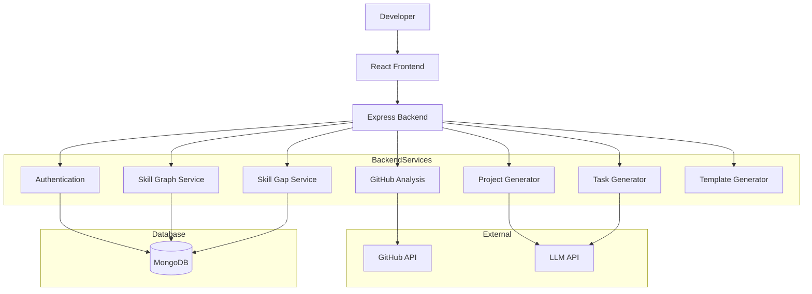

# AI Skill-Gap Based Personalized Project Generator

An AI-powered MERN stack platform that analyzes a developer’s GitHub repositories, evaluates skill proficiency, identifies skill gaps, and generates personalized project recommendations with task breakdowns and starter code templates.

---

## 🚀 Problem Statement

Developers often struggle to identify specific weaknesses in their programming skills. Most learning platforms provide generic courses rather than personalized, project-based learning aligned with real-world coding experience.

This project bridges that gap by:

- Analyzing GitHub activity
- Generating structured skill graphs
- Identifying targeted skill gaps
- Recommending personalized hands-on projects

---

## 🎯 Key Features

- 🔐 GitHub OAuth Authentication
- 📊 Automated GitHub Repository Analysis
- 🧠 Skill Graph Generation (0–100 scoring model)
- 📌 Skill Gap Detection
- 🤖 LLM-based Personalized Project Generation
- 📝 Task Breakdown with Difficulty & Time Estimates
- 🏗 Starter Code Template Generation
- 📈 Continuous Skill Progress Tracking

---

## 🏗 System Architecture



---

## 🛠 Tech Stack

### Frontend
- React
- Tailwind CSS
- Axios

### Backend
- Node.js
- Express.js
- JWT Authentication

### Database
- MongoDB

### AI Integration
- OpenAI / LLM API for:
  - Project idea generation
  - Task breakdown generation

---

## 🔄 How It Works

1. User logs in via GitHub OAuth
2. Repositories and commit activity are analyzed
3. Skill scores are generated (0–100 scale)
4. Skill gaps are identified
5. AI generates personalized project ideas
6. Projects are broken into actionable tasks
7. Starter templates are generated

---

## 📦 Installation (Development Setup)

```bash
git clone https://github.com/SaloniG02/ai-skill-gap-project-generator.git
cd ai-skill-gap-project-generator
npm install
```

### Environment Variables

Create a `.env` file:

```
GITHUB_CLIENT_ID=
GITHUB_CLIENT_SECRET=
JWT_SECRET=
OPENAI_API_KEY=
MONGO_URI=
```

Then start the application:

```bash
npm start
```

---

## 🔐 Security Considerations

- Passwords are securely hashed
- JWT authentication enforced
- HTTPS recommended for production
- GitHub tokens stored securely

---

## 📌 Hackathon Scope

This hackathon version focuses on:

- GitHub analysis
- Skill graph generation
- Skill gap detection
- AI-based project recommendation
- Task breakdown generation

Advanced production-level scaling and infrastructure are considered future improvements.

---

## 👩‍💻 Author

Saloni Yadav  
BTech Computer Science Student  

---

## 📄 License

This project is developed for educational and hackathon purposes.
