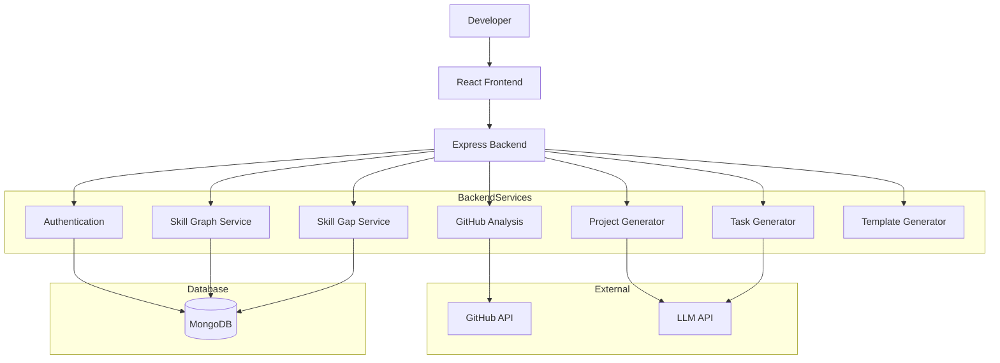

# Design Document  
# AI Skill-Gap Based Personalized Project Generator

---

## 1. Overview

The AI Skill-Gap Based Personalized Project Generator is a MERN-stack web application that analyzes a developer’s GitHub repositories to estimate their skill level and generate personalized project recommendations.

The system uses GitHub API data and Large Language Models (LLMs) to:
- Generate a skill graph
- Identify skill gaps
- Recommend tailored projects
- Break projects into tasks
- Provide starter code templates

This hackathon version focuses on core features required to demonstrate intelligent skill-based project generation.

---

## 2. MVP Scope (Hackathon Version)

The implemented features include:

- GitHub repository analysis (languages + commit activity)
- Skill score calculation
- Skill gap detection
- AI-based project idea generation
- Task breakdown generation
- Basic project template scaffolding

Advanced production features such as horizontal scaling, advanced DevOps pipelines, and premium plans are considered future improvements.

---

## 3. System Architecture

---

## 4. Technology Stack

### Frontend
- React
- Tailwind CSS
- Axios

### Backend
- Node.js
- Express.js
- JWT Authentication

### Database
- MongoDB

### AI Integration
- OpenAI / LLM API for:
  - Project idea generation
  - Task breakdown generation

---

## 5. Core Modules

### 5.1 Authentication Module
Handles:
- User registration and login
- JWT token generation
- Secure password hashing

---

### 5.2 GitHub Analysis Module
- Fetches repositories via GitHub API
- Detects programming languages used
- Analyzes commit activity
- Extracts basic project metadata

---

### 5.3 Skill Graph Module
- Calculates skill scores (0–100)
- Groups skills into categories:
  - Languages
  - Frameworks
  - Databases
  - Algorithms
- Stores results in MongoDB

---

### 5.4 Skill Gap Module
- Compares user skill scores with target role requirements
- Marks:
  - Weak skills (score < 60)
  - Missing skills (score = 0)
- Generates prioritized gap list

---

### 5.5 Project Generation Module
- Uses LLM to generate personalized project ideas
- Ensures project addresses 2–4 skill gaps
- Includes:
  - Objective
  - Technologies
  - Features
  - Stretch goals

---

### 5.6 Task Breakdown Module
- Converts project into 5–15 actionable tasks
- Assigns:
  - Difficulty level
  - Estimated time
- Orders tasks logically

---

### 5.7 Template Generator
- Generates basic project folder structure
- Includes:
  - Boilerplate files
  - README
  - Configuration template

---

## 6. Data Flow

### 6.1 Initial Analysis Flow

1. User logs in via GitHub OAuth  
2. Repositories are fetched  
3. Skills are calculated  
4. Skill gaps are identified  
5. Dashboard displays results  

---

### 6.2 Project Generation Flow

1. User selects “Generate Project”  
2. Skill graph + gap data retrieved  
3. LLM generates project idea  
4. Tasks are generated  
5. Template scaffold is created  

---

## 7. Data Models

### User
Stores:
- Authentication details
- GitHub ID
- Learning preferences

### SkillGraph
Stores:
- Skill scores
- Categories
- Timestamp

### SkillGap
Stores:
- Weak/missing skills
- Priority level

### Project
Stores:
- Title
- Description
- Skills addressed
- Difficulty
- Status

### Task
Stores:
- Description
- Difficulty
- Estimated hours
- Completion status

---

## 8. Security Considerations

- Passwords are hashed before storage  
- JWT used for authentication  
- HTTPS required for API communication  
- GitHub tokens stored securely  

---

## 9. Constraints

- Depends on GitHub API rate limits  
- Depends on LLM API availability  
- Skill scoring accuracy depends on repository quality  
- Hackathon implementation focuses on core functionality  
